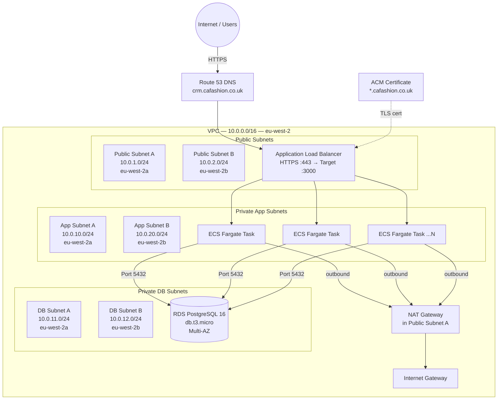

# Network Solution Design — CA Fashion Wholesale CRM

## Architecture Diagram

---

## Subnet & IP Addressing Plan

| Subnet | CIDR | AZ | Type | Usable IPs | Purpose |
|---|---|---|---|---|---|
| `ca-fashion-public-a` | `10.0.1.0/24` | eu-west-2a | Public | 251 | ALB, NAT Gateway |
| `ca-fashion-public-b` | `10.0.2.0/24` | eu-west-2b | Public | 251 | ALB (second AZ) |
| `ca-fashion-app-a` | `10.0.10.0/24` | eu-west-2a | Private | 251 | ECS Fargate tasks |
| `ca-fashion-app-b` | `10.0.20.0/24` | eu-west-2b | Private | 251 | ECS Fargate tasks |
| `ca-fashion-db-a` | `10.0.11.0/24` | eu-west-2a | Private | 251 | RDS primary |
| `ca-fashion-db-b` | `10.0.12.0/24` | eu-west-2b | Private | 251 | RDS standby (Multi-AZ) |

---

## Security Groups

### `sg-alb` — Application Load Balancer
| Direction | Protocol | Port | Source | Purpose |
|---|---|---|---|---|
| Inbound | TCP | 443 | `0.0.0.0/0` | HTTPS from internet |
| Inbound | TCP | 80 | `0.0.0.0/0` | HTTP redirect to HTTPS |
| Outbound | TCP | 3000 | `sg-ecs` | Forward to ECS tasks |

### `sg-ecs` — ECS Fargate Tasks
| Direction | Protocol | Port | Source | Purpose |
|---|---|---|---|---|
| Inbound | TCP | 3000 | `sg-alb` | Traffic from ALB only |
| Outbound | TCP | 5432 | `sg-rds` | Connect to database |
| Outbound | TCP | 443 | `0.0.0.0/0` | ECR image pull, CloudWatch, Secrets Manager |

### `sg-rds` — RDS PostgreSQL
| Direction | Protocol | Port | Source | Purpose |
|---|---|---|---|---|
| Inbound | TCP | 5432 | `sg-ecs` | DB access from ECS only |
| Outbound | All | All | — | None needed |

---

## Routing Tables

### Public Route Table (`ca-fashion-public-rt`)
| Destination | Target |
|---|---|
| `10.0.0.0/16` | local |
| `0.0.0.0/0` | Internet Gateway |

### Private Route Table (`ca-fashion-private-rt`)
| Destination | Target |
|---|---|
| `10.0.0.0/16` | local |
| `0.0.0.0/0` | NAT Gateway |

---

## Auto Scaling Configuration

| Setting | Value |
|---|---|
| Min tasks | 1 |
| Max tasks | 4 |
| Desired tasks | 2 |
| Scale-out trigger | Average CPU > 70% for 2 minutes |
| Scale-in trigger | Average CPU < 30% for 5 minutes |
| Cool-down (out) | 60 seconds |
| Cool-down (in) | 300 seconds |
